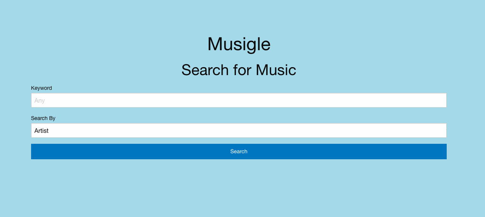

# Musigle

## Description

Welcome to Musigle, a music search engine designed to provide everything you look for in a search engine, all in one place. Musigle uses the Last.fm Music Discovery API to process your query and generate the artist, song, and album information you're looking for. Along with the music information, Musigle generates a YouTube player to listen to the song and displays upcoming events information about the current artist. 

Future Plans

-Impliment a more comprehensive and easier to use music API.
-Integrate the TasteDive API to provide you with music, movie , book, and other recommendations that users may like based upon their music search query.

Deployment

You can visit the live application [here](https://aidanamato.github.io/music-search-project/).

## Authors

Aidan Amato
Alex Hinds
Tyler Pennington
Mike Tutor

## Credits

APIs 
-[Last.fm Music Discovery API](https://www.last.fm/api)
-[Ticketmaster Discovery API](https://developer.ticketmaster.com/products-and-docs/apis/discovery-api/v2/)
-[Youtube Data API](https://developers.google.com/youtube/v3)

[Staatliches Regular 400 - Google Fonts](https://fonts.google.com/specimen/Staatliches#standard-styles)

## License

[MIT](./LICENSE.txt)